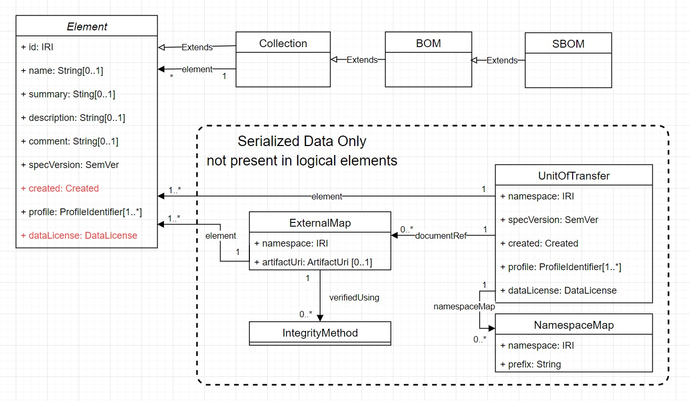

# SPDX v3 Element Serialization

In the SPDX v3 logical model, Element is the basic unit of information, and every Element is
independent of all other Elements. An SPDX "document" or "unit of transfer" is the serialized
value of one or more Elements.

The UnitOfTransfer type defines the structure of an SPDX v3 document.
* UnitOfTransfer is not an Element.
* Serialized data can be illustrated but not defined in the logical model because logical models do not address syntax.
* UnitOfTransfer is defined in the [information model](Schemas/spdx-v3.jidl).
* An optional Document Element may be created to describe a document and list the Element values it contains.

A document contains:
1. the document unique identifier (namespace)
2. document properties (specVersion, created (who and when), profiles, and dataLicense)
3. a set of one or more defined or copied Element values
4. optional references to other documents, allowing elements in those documents to be located, verified and referenced 
5. optional namespace prefixes used to shorten Element identifiers

A document may include Elements in three categories:
1. Elements created as part of the document ("defined" in the document minting operation)
2. References to documents containing previously-created Elements ("referenced" by the document)
3. Copies of previously-created Elements ("copied" into the document)

Defined element ids are under the document's id/namespace. Element creation info = document creation info.
Other element properties (specVersion, profiles, dataLicense) may override the Document defaults.
All other element values in a document are copied from prior minting operations,
with element ids under the corresponding document namespaces.

## Design Considerations

Every Element reference can be verified for integrity as a member of one or more documents.
If an Element created in one document is copied into other documents,
references to any of those documents can verify Element integrity.
In particular, re-serializing an Element into a single-Element document allows each
Element to be verified by a single integrity check value regardless of any
documents it was created in or copied to.

## Serialization as shown in the logical model

